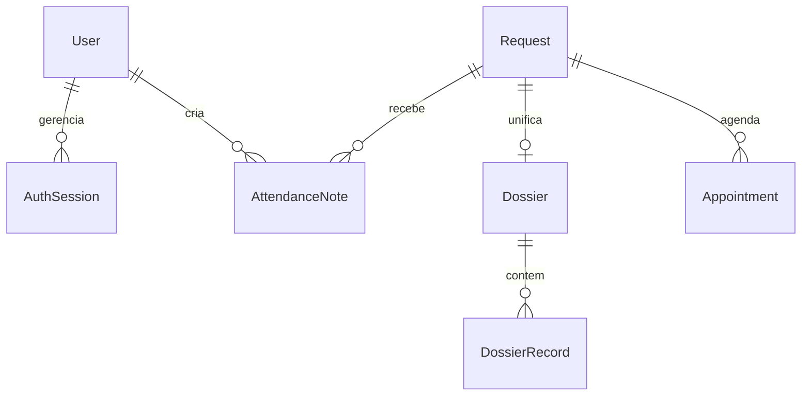

# SAM Backend (Sistema de Atendimento Multidisciplinar)

Backend robusto desenvolvido em Node.js com NestJS e PostgreSQL, arquitetado em **microsserviços** de alta performance com comunicação centralizada através de um API Gateway dinâmico.

---

## 🏗️ Arquitetura de Microsserviços

*   **`sam-gateway` (Porta `3000`):** Ponto de entrada único (API Gateway) que realiza o roteamento reverso de requisições externas para os respectivos serviços e centraliza as regras de tráfego.
*   **`sam-auth-service` (Porta `3001`):** Gerenciamento de credenciais, emissão de JWTs e controle de fluxo de ciclo de vida de sessões.
*   **`sam-user-service` (Porta `3002`):** Cadastro de colaboradores, perfis de acesso, registros de conselho (CRP) e armazenamento encriptado de sessões ativas e anotações rápidas de acolhimento.
*   **`sam-request-service` (Porta `3003`):** Triagem e gerenciamento do ciclo de vida de solicitações/protocolos de alunos (`PENDENTE`, `EM_ANALISE`, `EM_ATENDIMENTO`, `CONCLUIDA`).
*   **`sam-appointment-service` (Porta `3004`):** Clínico, responsável pelos agendamentos de sessões, geração de prontuários, evoluções clínicas com controle de visibilidade e estatísticas do Dashboard da Psicóloga.

---

## 🚀 Fases Implementadas

Recentemente concluímos com sucesso três marcos evolutivos de segurança e maturidade clínica do sistema:
1.  **Fase 1: Anotações de Atendimento (`AttendanceNote`):** Evoluções e acolhimentos rápidos integrados ao `sam-user-service`.
2.  **Fase 2: Evoluções do Dossiê (`DossierRecord`):** Prontuário clínico detalhado de dossiês com tags e restrições de visibilidade no `sam-appointment-service`.
3.  **Fase 3: Rotação de Sessões e Refresh Tokens (`AuthSession`):** Mecanismo de persistência segura e rotação contra roubo de sessões integrado de forma cruzada entre o `sam-auth-service` e o `sam-user-service`.

---

## 📋 Pré-requisitos

*   Node.js 20+
*   Docker & Docker Compose

---

## 🛠️ Configuração e Inicialização Local

### 1) Subir o Banco de Dados PostgreSQL
Suba a instância oficial do banco utilizando o Docker Compose:
```bash
docker compose up -d
```

### 2) Instalar Dependências do Workspace
Instale as dependências centralizadas no diretório raiz do projeto:
```bash
npm install
```

### 3) Configurar Variáveis de Ambiente
Utilize o arquivo `.env.example` na raiz do projeto como modelo para criar os arquivos `.env` necessários em cada microsserviço que necessitar de configurações exclusivas.

### 4) Gerar Prisma Client nos Microsserviços
Execute a geração do cliente do ORM para os serviços acoplados à persistência de dados:
```bash
npm --workspace sam-user-service run prisma:generate
npm --workspace sam-request-service run prisma:generate
npm --workspace sam-appointment-service run prisma:generate
```

### 5) Inicializar Todos os Microsserviços
Abra terminais independentes ou rode em segundo plano os seguintes comandos na raiz do projeto:
```bash
# Executa o Microsserviço de Autenticação (Porta 3001)
npm run start:auth

# Executa o Microsserviço de Usuários e Sessões (Porta 3002)
npm run start:users

# Executa o Microsserviço de Solicitações (Porta 3003)
npm run start:requests

# Executa o Microsserviço Clínico e de Agendamentos (Porta 3004)
npm run start:appointments

# Executa o API Gateway Centralizador (Porta 3000)
npm run start:gateway
```

---

## 📡 Catálogo Completo de Rotas via API Gateway (Porta `3000`)

### 🔐 Autenticação e Sessões
*   `POST /sam/auth/login` - Efetua o login inicial (Retorna Access Token, Refresh Token e dados do Usuário).
*   `POST /sam/auth/refresh` - Roda e renova o par de tokens sem forçar o logout do usuário.
*   `POST /sam/auth/logout` - Finaliza a sessão ativa revogando o Refresh Token da base de dados.

### 👥 Gestão de Colaboradores e Perfis
*   `POST /sam/users` - Cadastra um novo profissional (Administrador, Psicóloga, Supervisor, Gestor).
*   `GET /sam/users` - Retorna a lista de colaboradores ativos.
*   `PATCH /sam/users/:id` - Atualiza informações de perfil.
*   `DELETE /sam/users/:id` - Exclui o cadastro de um colaborador.

### 📝 Anotações e Acolhimento Rápido (`AttendanceNote`)
*   `POST /sam/users/notes` - Cria uma evolução de atendimento rápido para uma solicitação.
*   `GET /sam/users/notes/request/:requestId` - Retorna todas as anotações rápidas vinculadas a uma solicitação.
*   `GET /sam/users/notes/:id` - Obtém os detalhes estruturados de uma única anotação.
*   `PATCH /sam/users/notes/:id` - Edita parcialmente o título, descrição ou tags da nota.
*   `DELETE /sam/users/notes/:id` - Remove uma anotação de acolhimento rápido.

### 📂 Triagem e Solicitações de Atendimento (`sam-request-service`)
*   `POST /sam/requests` - Abre um novo protocolo/solicitação de acompanhamento para um estudante.
*   `GET /sam/requests` - Lista as solicitações em andamento com suporte a ordenações e filtros.
*   `PATCH /sam/requests/:id` - Atualiza dados cadastrais da solicitação.
*   `PATCH /sam/requests/:id/status` - Altera a etapa do funil de atendimento (fecha e registra `concludedAt` caso movido para `CONCLUIDA`).
*   `DELETE /sam/requests/:id` - Exclui a solicitação.

### 📅 Agenda de Atendimentos (`sam-appointment-service`)
*   `POST /sam/appointments` - Agenda uma sessão clínica entre um psicólogo e uma solicitação de aluno.
*   `GET /sam/appointments` - Lista a agenda e os agendamentos registrados no sistema.
*   `PATCH /sam/appointments/:id/status` - Modifica o andamento de um atendimento (Ex: `COMPARECEU`, `FALTOU`).

### 📁 Dossiê Terapêutico e Prontuários (`Dossier`)
*   `POST /sam/appointments/dossiers` - Cria/atualiza o dossiê clínico integrador de uma solicitação de aluno.
*   `GET /sam/appointments/dossiers` - Retorna todos os prontuários e dossiês abertos.
*   `GET /sam/appointments/dossiers/request/:requestId` - Busca o prontuário unificado de um aluno a partir de sua solicitação correspondente.
*   `GET /sam/appointments/dossiers/:id` - Obtém os detalhes de um dossiê clínico específico.
*   `PATCH /sam/appointments/dossiers/:id` - Modifica dados cadastrais ou status do dossiê.
*   `DELETE /sam/appointments/dossiers/:id` - Remove o dossiê.

### 🩺 Evoluções Clínicas de Longo Prazo (`DossierRecord`)
*   `POST /sam/appointments/dossiers/:dossierId/records` - Adiciona um registro clínico cronológico detalhado com status de visibilidade (`PRIVADO_PSICOLOGA` ou `ADMINISTRATIVO`).
*   `GET /sam/appointments/dossiers/:dossierId/records` - Lista cronologicamente todas as evoluções clínicas associadas a este dossiê.
*   `GET /sam/appointments/records/:id` - Detalha uma evolução clínica específica.
*   `PATCH /sam/appointments/records/:id` - Atualiza o título, o texto descritivo, as tags ou a visibilidade da evolução.
*   `DELETE /sam/appointments/records/:id` - Exclui a evolução do prontuário do dossiê.

---

## 🔐 Modelo de Dados e Relações



---

## 📈 Próximos Passos Recomendados

*   **Migrações de Banco:** Executar e versionar migrations reais do Prisma utilizando banco integrado no CI.
*   **Controle de Acessos Dinâmico (RBAC):** Criar um decorator `@Roles()` integrado às headers do Gateway para proteção de rotas privadas (ex: apenas psicólogos lêem prontuários do tipo `PRIVADO_PSICOLOGA`).
*   **Cobertura de Testes:** Criar suíte de testes unitários com Jest e testes integrados e2e do fluxo de login e rotação.
*   **Observabilidade integrada:** Logs estruturados centralizados via Winston ou Pino para as transações distribuídas do backend.
