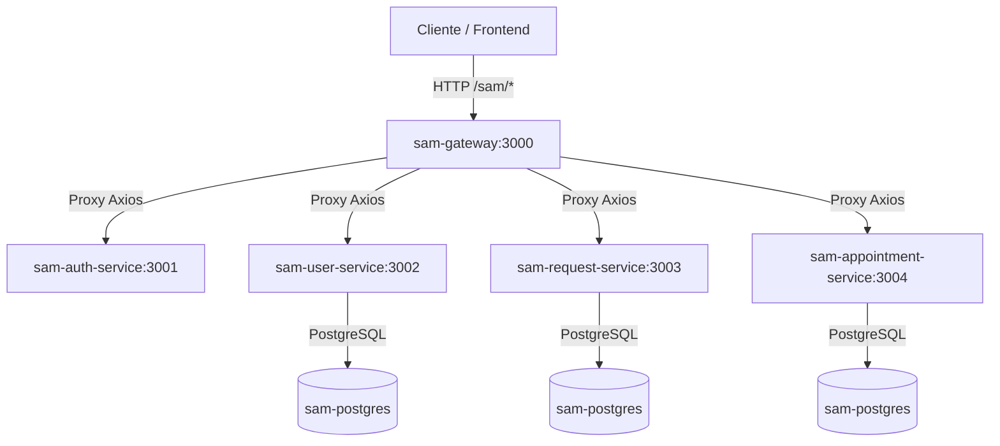

# Análise da Arquitetura e Implementação - SAM Backend

Este documento apresenta uma análise técnica aprofundada da estrutura de microsserviços e da implementação atual do sistema **SAM (Serviço de Atendimento Multidisciplinar / Psicológico)**.

---

## 🗺️ Visão Geral da Arquitetura

O sistema é construído sobre uma arquitetura de microsserviços utilizando **NestJS** como framework principal, **TypeScript** como linguagem, **Prisma ORM** para interação com o banco de dados **PostgreSQL** e **Docker** para containerização e infraestrutura de banco de dados.

A comunicação externa é centralizada por meio de um Gateway de API, que direciona as requisições para quatro microsserviços internos especializados.

---

## 🔍 Análise de Cada Microsserviço

### 1. `sam-gateway` (Porta: 3000)
Atua como o ponto de entrada único para o sistema (API Gateway), fornecendo roteamento reverso e simplificando o consumo do backend pelo cliente.

*   **Tecnologia:** NestJS, Axios, ConfigService.
*   **O que está implementado:**
    *   Roteador dinâmico de requisições (`proxy.controller.ts`) que mapeia todos os caminhos públicos do sistema (`/sam/auth/*`, `/sam/users/*`, `/sam/requests/*`, `/sam/appointments/*`).
    *   Um serviço de Proxy (`proxy.service.ts`) configurável através de variáveis de ambiente (`.env`), que encaminha os corpos das requisições, métodos HTTP (`GET`, `POST`, `PATCH`, `DELETE`) e propaga os cabeçalhos de autorização (`Authorization: Bearer <JWT>`).

---

### 2. `sam-auth-service` (Porta: 3001)
Responsável pelo fluxo de login, autenticação e emissão de tokens de segurança para os usuários do sistema.

*   **Tecnologia:** NestJS, `@nestjs/jwt`, `@nestjs/axios` (para comunicação interna), `bcrypt`.
*   **O que está implementado:**
    *   Endpoint de Login público: `POST /sam/auth/login`.
    *   **Fluxo de Autenticação:**
        1. Consulta o microsserviço de usuários internamente (`/sam/users/internal/by-email/:email`) para obter o cadastro e o hash da senha.
        2. Valida as credenciais comparando o hash com a senha digitada usando `bcrypt.compare`.
        3. Se válido, emite um token **JWT** contendo dados essenciais no payload (`sub` como ID, `email`, `role`, `name`).
    *   Tratamento de exceções com resposta padronizada para credenciais inválidas.

---

### 3. `sam-user-service` (Porta: 3002)
Responsável pela gestão de usuários (administradores, psicólogas educacionais, gestores e supervisores pedagógicos) e permissões de acesso.

*   **Tecnologia:** NestJS, Prisma ORM (Banco de Dados PostgreSQL), `bcrypt`.
*   **O que está implementado:**
    *   **CRUD Completo de Usuários:** Cadastro (`POST`), listagem (`GET`), atualização (`PATCH`) e exclusão (`DELETE`).
    *   **Regras de Negócio e Validações:**
        *   Garante unicidade de E-mail e CRP (Conselho Regional de Psicologia).
        *   *Regra de Perfil:* O CRP é obrigatório se o papel (`UserRole`) for `PSICOLOGA_EDUCACIONAL`.
        *   *Regra de Lotação:* A unidade de trabalho (`WorkUnit`) é obrigatória para `SUPERVISAO` e `PSICOLOGA_EDUCACIONAL`.
    *   Criptografia automática de senhas com `bcrypt` no cadastro e atualização.
    *   Exposição de rota interna para o serviço de autenticação buscar dados sensíveis por e-mail de forma segura.
*   **Esquema de Dados (Prisma Schema):**
    *   `User`: Representa os usuários e seus perfis.
    *   `AuthSession`: Preparado no banco para gerenciar sessões ativas e tokens de atualização (*Refresh Tokens*), embora ainda não integrado às controllers de rotas.
    *   `AttendanceNote`: Tabela mapeada para anotações rápidas e marcações de atendimento por tags (Ex: `option_tags`), sem implementação lógica ativa nos serviços TypeScript ainda.

---

### 4. `sam-request-service` (Porta: 3003)
Gerencia a abertura e a triagem de solicitações/demandas de atendimento para os alunos das unidades de ensino.

*   **Tecnologia:** NestJS, Prisma ORM.
*   **O que está implementado:**
    *   **Gestão de Solicitações:** Criação (`POST`), listagem geral (`GET`), alteração de campos gerais (`PATCH /:id`), atualização de status (`PATCH /:id/status`) e exclusão (`DELETE`).
    *   **Campos Relevantes no Banco:** Número do protocolo gerado automaticamente (cuid), dados do requisitante e do estudante (matrícula, turma, tipo de curso), motivo da solicitação, prioridade (`BAIXA`, `MEDIA`, `ALTA`), psicólogo(a) responsável designado e data de conclusão.
    *   **Automatização de Regra:** Ao alterar o status da solicitação para `CONCLUIDA`, o microsserviço preenche de forma automática a data atual em `concludedAt`.
*   **Esquema de Dados (Prisma Schema):**
    *   `Request`: Representa a solicitação do atendimento, rastreando o ciclo de vida desde `PENDENTE` até `CONCLUIDA`, `INDEFERIDA` ou `CANCELADA`.

---

### 5. `sam-appointment-service` (Porta: 3004)
Este é o microsserviço central para o trabalho clínico. Ele gerencia o agendamento de sessões individuais e o preenchimento de dossiês terapêuticos detalhados sobre as demandas dos alunos.

*   **Tecnologia:** NestJS, Prisma ORM.
*   **O que está implementado:**
    *   **Agendamentos (Appointments):** Criação de agendamentos (`POST`), listagem (`GET`) e atualização de status (`PATCH /:id/status` para `AGENDADO`, `REALIZADO` ou `CANCELADO`).
    *   **Dossiês de Acompanhamento (Dossiers):**
        *   Criação ou atualização unificada (*Upsert* por ID de solicitação).
        *   Busca de dossiês por psicólogo, ID específico ou ID da solicitação associada.
        *   Atualização detalhada e exclusão de dossiês.
        *   *Regra de Validação:* Não é permitido concluir (`status = CONCLUIDO`) um dossiê sem que a data de encerramento (`attendanceEndDate`) tenha sido fornecida na requisição ou já esteja salva no banco. Se não for especificada mas for válida, o sistema define como a data/hora atual.
    *   **Painel Clínico Inteligente (`psychologistDashboard`):**
        *   Um endpoint de agregação de métricas para a psicóloga com base em um período (Semanal ou Mensal) e data de referência.
        *   Gera um **resumo consolidado** de atendimentos (Totais, Realizados, Agendados, Cancelados e com pendências).
        *   Faz o ranqueamento das **tipologias de queixas** mais frequentes (extraídas dos dossiês no período).
        *   Faz o ranqueamento das **ações/intervenções** mais executadas.
        *   Lista os atendimentos pendentes de resolução com detalhes de contato e atualização do dossiê.
*   **Esquema de Dados (Prisma Schema):**
    *   `Appointment`: Tabela de agendamentos de sessões.
    *   `Dossier`: Dossiê psicológico estruturado, contendo queixas, ações tomadas, anotações, pendências e ciclo de vida (`EM_ANDAMENTO`, `CONCLUIDO`, `ARQUIVADO`).
    *   `DossierRecord`: Histórico descritivo complementar associado aos dossiês (com visibilidade configurável `PRIVADO_PSICOLOGA` ou `ADMINISTRATIVO`), criado no banco mas ainda não implementado na controller/serviço TypeScript.

---

## 📊 Tabela Comparativa de Recursos e Entidades

Abaixo está o mapeamento do status atual de implementação das entidades de banco de dados nos microsserviços TypeScript:

| Microsserviço | Entidade no Schema | Implementação no Banco (Prisma) | Controladores e Serviços NestJS | Status Técnico / Observações |
| :--- | :--- | :---: | :---: | :--- |
| **sam-user-service** | `User` | ✅ Sim | ✅ Sim | Completo (CRUD com validações complexas e criptografia) |
| **sam-user-service** | `AuthSession` | ✅ Sim | ❌ Não | Apenas tabela criada no banco. O fluxo de login atual emite apenas o token JWT sem persistir sessões de Refresh Token. |
| **sam-user-service** | `AttendanceNote` | ✅ Sim | ❌ Não | Apenas tabela criada no banco. |
| **sam-request-service**| `Request` | ✅ Sim | ✅ Sim | Completo (CRUD com fluxo automático de data de conclusão) |
| **sam-appointment-service** | `Appointment` | ✅ Sim | ✅ Sim | Completo (Agendamentos e integração com Dossiês) |
| **sam-appointment-service** | `Dossier` | ✅ Sim | ✅ Sim | Completo (CRUD, Upsert e Inteligência do Dashboard) |
| **sam-appointment-service** | `DossierRecord`| ✅ Sim | ❌ Não | Apenas tabela criada no banco. Destina-se ao registro detalhado de evoluções com controle de visibilidade. |

---

## 🎯 Conclusão da Análise

O sistema possui uma fundação arquitetural extremamente sólida e bem dividida. Os fluxos fundamentais de **Autenticação**, **Controle de Usuários**, **Triagem de Solicitações (Request)**, **Agendamentos** e **Registro de Dossiê Clínico com Dashboard** estão totalmente estruturados e funcionais, aguardando apenas a execução de migrações no banco de dados e a geração dos clientes Prisma locais para entrar em plena operação.

> [!NOTE]
> Conforme solicitado, **nenhuma alteração de código ou configuração foi realizada** no repositório. O projeto encontra-se exatamente no estado em que foi analisado.
