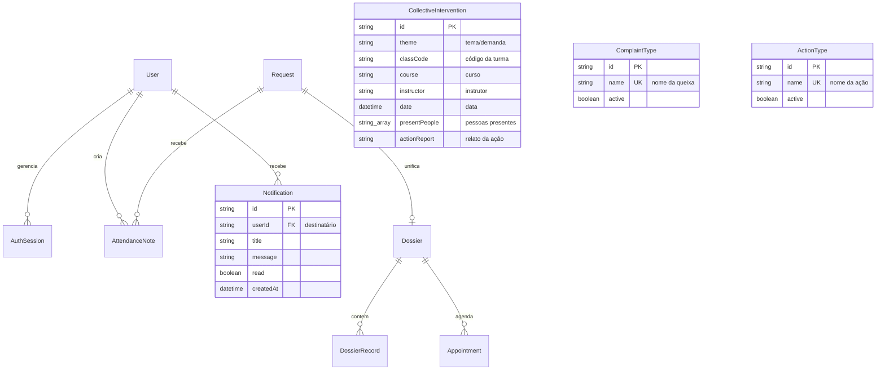
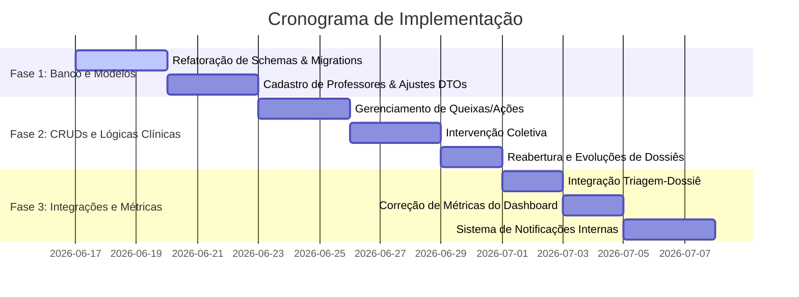

# Plano de Adequação de Requisitos e Análise de Impacto - SAM Backend

Este documento apresenta uma análise técnica detalhada do estado atual do sistema **SAM (Serviço de Atendimento Multidisciplinar)** e propõe um planejamento estruturado de ações para implementar as modificações solicitadas.

---

## 🔍 1. Análise do Estado Atual (As-Is)

O sistema SAM Backend é composto por uma arquitetura de microsserviços baseada em **NestJS** e **Prisma ORM**, distribuído em bancos de dados PostgreSQL individuais no Neon. A comunicação é orquestrada por um **API Gateway** centralizador.

### Situação Atual dos Recursos Relacionados:
*   **Métricas e Dashboards:** O microsserviço `sam-appointment-service` possui o endpoint de dashboard da psicóloga, porém ele calcula os totais agregados de atendimentos, andamento e cancelamento a partir da tabela de `Dossier` (Dossiês), deixando de considerar os dados da tabela de `Appointment` (Sessões agendadas), o que gera inconsistências com os conceitos reais de sessões semanais/mensais.
*   **Encaminhamento e Protocolo:** A tabela `Request` (`sam-request-service`) possui prioridades estáticas (`BAIXA`, `MEDIA`, `ALTA`) e o número de protocolo é gerado através de um `cuid()` aleatório no nível de banco de dados, o que dificulta a leitura humana. Além disso, a aceitação do atendimento altera o status para `EM_ATENDIMENTO`, mas não integra a criação do dossiê no microsserviço clínico.
*   **Cadastro de Professores:** O enum de papéis (`UserRole`) gerencia apenas perfis administrativos e clínicos corporativos (`ADMIN`, `PSICOLOGA_EDUCACIONAL`, `SUPERVISAO`, `GESTAO`), impossibilitando o acesso e abertura de solicitações por parte dos docentes.
*   **Evoluções e Ações/Queixas:** As evoluções clínicas (`DossierRecord`) já possuem uma estrutura física de banco pronta no `sam-appointment-service`, mas a controller não está integrada a regras de controle de visibilidade baseadas em roles no Gateway. Adicionalmente, as tipologias de queixas e ações são armazenadas como arrays brutos de strings no banco de dados (`String[]`), sem uma governança ou cadastro dinâmico no sistema.

---

## 📊 2. Matriz de Impacto das Mudanças (As-Is vs. To-Be)

Abaixo está o mapeamento dos microsserviços, tabelas e arquivos afetados por cada alteração solicitada.

| ID | Modificação Solicitada | Impacto Arquitetural | Tabelas Afetadas | Arquivos a Alterar/Criar | Status |
| :--- | :--- | :--- | :--- | :--- | :--- |
| **01** | Consertar métricas nos dashboards | Lógica de agregação | `appointments`, `dossiers` | `appointment.service.ts` | **Implementado** |
| **02** | Direcionar aceitação para o Dossiê | Integração síncrona HTTP | `dossiers` | `request.service.ts` (chamada HTTP para criar dossiê) | **Implementado** |
| **03** | Cadastro para professores | Modificação de Enum e Fluxo | `users` | `schema.prisma` (users), `create-user.dto.ts` | **Implementado** |
| **04** | Retirar prioridade do atendimento | Remoção de coluna | `requests` (remove `priority`) | `schema.prisma` (requests), DTOs de Request | **Implementado** |
| **05** | Acrescentar nome do curso | Adição de coluna | `requests`, `dossiers` | `schema.prisma` (ambos), DTOs correspondentes | **Implementado** |
| **06** | Mudar o dado do registro do protocolo | Lógica de geração | `requests` (remove default) | `request.service.ts` (gerador customizado) | **Implementado** |
| **07** | Gerenciamento de queixas | Nova Entidade (CRUD) | `complaint_types` (nova) | Criar módulo `complaint-types` em `appointment-service` | **Implementado** |
| **08** | Gerenciamento de ações | Nova Entidade (CRUD) | `action_types` (nova) | Criar módulo `action-types` em `appointment-service` | **Implementado** |
| **09** | Notificação de atendimentos para psicóloga| Endpoint Dinâmico de Notificações | Nenhuma (dados dinâmicos de `requests`) | Criar endpoint `/sam/requests/notifications` em `request-service` | **Implementado** |
| **10** | Reabertura de dossiês | Novo Endpoint de Status | `dossiers`, `dossier_records` | `appointment.service.ts`, `appointment.controller.ts` | **Implementado** |
| **11** | Evolução de dossiês | Ajuste de Acesso e Visibilidade| `dossier_records` | `records.service.ts`, `records.controller.ts` | **Implementado** |
| **12** | Intervenção coletiva (eventos) | Nova Entidade (CRUD) | `collective_interventions` | Criar módulo `collective-intervention` em `appointment-service` | **Implementado** |

---

## 📐 3. Modelo de Dados Atualizado (To-Be)

Abaixo está a representação conceitual das novas tabelas e relacionamentos adicionados ao sistema.

---

## 🛠️ 4. Detalhamento de Ações por Requisito

### 📈 R-01: Correção de Métricas nos Dashboards (`sam-appointment-service`)
*   **Problema:** O dashboard calcula o andamento de sessões com base nos status de `Dossier`. No entanto, sessões agendadas são `Appointment`.
*   **Ação:** Refatorar o método `psychologistDashboard` para mapear os dados do array `appointments` retornado no período:
    *   `scheduled`: total de `Appointment` com status `AGENDADO`.
    *   `realized`: total de `Appointment` com status `REALIZADO`.
    *   `cancelled`: total de `Appointment` com status `CANCELADO`.
    *   `totalAttendances`: total de agendamentos (`appointments.length`) ou dossiês ativos no período, conforme a definição final de visualização.
    *   `withPendingIssues`: quantidade de dossiês que possuem `pendingIssues` não vazias.

### 🔄 R-02: Criação Automática do Dossiê na Aceitação do Atendimento (`sam-request-service` $\rightarrow$ `sam-appointment-service`)
*   **Problema:** A triagem e a clínica são isoladas. Quando o supervisor altera o status do request para `EM_ATENDIMENTO`, o dossiê precisa ser criado para que a psicóloga prossiga.
*   **Ação:** 
    1.  No `RequestService` (`sam-request-service`), ao atualizar o status para `EM_ATENDIMENTO`:
        *   Disparar uma requisição HTTP via `HttpService` para o microsserviço clínico: `POST /sam/appointments/dossiers` (através do endpoint interno ou via Gateway).
        *   Enviar os dados básicos copiados do aluno: `requestId`, `studentName`, `studentRegistration`, `classCode`, `courseType`, `courseName`, `requesterName`, `demandReport` (vindo de `reason`), e `psychologistId` (vindo de `targetPsychologistId`).
    2.  O endpoint de atualização do request retornará os dados atualizados com o ID do dossiê para que o frontend faça o redirecionamento automático imediato.

### 👥 R-03: Cadastro e Encaminhamento de Professores (`sam-user-service`)
*   **Problema:** Professores não possuem perfil no sistema para registrar demandas.
*   **Ação:**
    1.  Adicionar `PROFESSOR` ao enum `UserRole` no `schema.prisma` de `sam-user-service`.
    2.  Atualizar o DTO `CreateUserDto` e `UpdateUserDto` para aceitar `PROFESSOR`.
    3.  **Fluxo de Encaminhamento:** O professor cria uma solicitação (`Request`) com status `PENDENTE`. Os supervisores pedagógicos (`SUPERVISAO`) filtram as solicitações pendentes e utilizam a rota de atualização do request para adicionar a descrição do supervisor (`supervisorDescription`), selecionar o psicólogo responsável (`targetPsychologistId`), alterando o status do atendimento para `EM_ANALISE` ou `EM_ATENDIMENTO`.

### 🗑️ R-04: Remoção do Nível de Prioridade do Atendimento (`sam-request-service`)
*   **Problema:** Nível de prioridade não é mais necessário nas triagens.
*   **Ação:**
    1.  Remover o campo `priority` e o enum `RequestPriority` do arquivo `schema.prisma`.
    2.  Remover o campo `priority` de `CreateRequestDto` e `UpdateRequestDto`.
    3.  Ajustar o `RequestService` para desconsiderar a prioridade nas operações de criação e atualização.
    4.  Executar `npx prisma db push` para limpar a coluna no banco de dados.

### 🎓 R-05: Preenchimento do Nome do Curso (`sam-request-service` & `sam-appointment-service`)
*   **Problema:** O sistema possui apenas a tipologia do curso (Aprendizagem, Técnico), mas não o nome do curso (ex: *Técnico em Enfermagem*).
*   **Ação:**
    1.  Adicionar `courseName String @map("course_name")` nos modelos `Request` e `Dossier` nos respectivos arquivos `schema.prisma`.
    2.  Atualizar os DTOs de entrada em ambos os serviços para aceitar e validar a string do nome do curso.
    3.  Ajustar os métodos de criação e atualização nos serviços para persistirem o campo `courseName`.

### 🔢 R-06: Alteração do Formato de Registro de Protocolo (`sam-request-service`)
*   **Problema:** O protocolo atual usa `cuid()` (ex: `cl08d...`), que não é amigável.
*   **Ação:**
    1.  Remover `@default(cuid())` da propriedade `protocolNumber` no `schema.prisma`.
    2.  No `RequestService`, implementar uma função geradora de protocolo no momento da criação:
        *   Formato sugerido: `SAM-YYYY-XXXXX` (onde YYYY é o ano corrente e XXXXX é um sequencial preenchido com zeros, ex: `SAM-2026-00042`).
        *   A lógica fará um `count` dos registros criados no ano corrente para obter o próximo sequencial.

### 🏷️ R-07 e R-08: Gerenciamento Dinâmico de Queixas e Ações (`sam-appointment-service`)
*   **Problema:** Tipologias de queixas e ações tomadas são arrays de strings estáticos sem controle centralizado.
*   **Ação:**
    1.  Adicionar os modelos `ComplaintType` (queixas) e `ActionType` (ações) no `schema.prisma`.
    2.  Criar os módulos de CRUD para ambas as entidades (Controller, Service, DTOs).
    3.  A psicóloga poderá gerenciar essa lista através de endpoints públicos (`POST /sam/appointments/complaint-types`, etc.).
    4.  No momento do cadastro/edição do dossiê, o serviço clínico validará se os itens enviados em `complaintTypologies` e `selectedActions` existem no cadastro dinâmico ativo antes de salvar.

### 🔔 R-09: Notificação de Cadastro de Atendimento para a Psicóloga (`sam-request-service` $\rightarrow$ Gateway)
*   **Problema:** A psicóloga precisa ser avisada no frontend (através de um badge no menu lateral) sobre novas solicitações destinadas a ela que ainda não foram aceitas (status `PENDENTE` ou `EM_ANALISE`).
*   **Ação:**
    1.  Expor o endpoint `GET /sam/requests/notifications` na `RequestController` do `sam-request-service` recebendo o query parameter `psychologistId`.
    2.  O endpoint filtrará e retornará a lista e o contador (`count`) de solicitações onde `targetPsychologistId` corresponde ao ID informado e o status seja `PENDENTE` ou `EM_ANALISE`.
    3.  Mapear e expor a rota no `sam-gateway` para `GET /sam/requests/notifications`.

### 🔓 R-10: Fluxo de Reabertura de Dossiês (`sam-appointment-service`)
*   **Problema:** Um dossiê concluído não possui fluxo explícito para reabertura de acompanhamento.
*   **Ação:**
    1.  Expor a rota `POST /sam/appointments/dossiers/:id/reopen` na `AppointmentController`.
    2.  No serviço, validar se o dossiê existe e está no status `CONCLUIDO`.
    3.  Atualizar o status para `EM_ANDAMENTO`, limpar o campo `attendanceEndDate` (definir como `null`) e gerar um `DossierRecord` (evolução clínica) cronológico automático com o título *"Dossiê Reaberto"*, registrando o profissional que efetuou a ação.

### 📝 R-11: Evolução de Dossiês (Segurança e Visibilidade)
*   **Problema:** A tabela `DossierRecord` existe, mas precisa garantir a regra de confidencialidade clínica.
*   **Ação:**
    1.  Validar e testar os endpoints de `DossierRecord`.
    2.  Implementar no Gateway (ou na controller de records) a checagem do papel do usuário logado:
        *   Registros com `visibility = PRIVADO_PSICOLOGA` só devem ser retornados caso o usuário que faz a requisição possua a role `PSICOLOGA_EDUCACIONAL`.
        *   Registros `ADMINISTRATIVO` podem ser lidos por supervisores e gestores.

### 📅 R-12: Módulo de Intervenção Coletiva e Eventos (`sam-appointment-service`)
*   **Problema:** O sistema foca apenas em atendimentos individuais, sem suporte para ações coletivas nas turmas.
*   **Ação:**
    1.  Criar a tabela `CollectiveIntervention` no `schema.prisma` com as propriedades: `id`, `theme`, `classCode`, `course`, `instructor`, `date`, `presentPeople` (lista de strings/nomes preenchida posteriormente) e `actionReport` (texto livre de relato preenchido posteriormente).
    2.  Criar o CRUD completo de Intervenções Coletivas.
    3.  Mapear e expor as rotas no `sam-gateway`.

---

## 🚀 5. Cronograma de Execução Incremental

Para mitigar riscos e validar o sistema de forma contínua, propomos a execução em **3 Fases**:

> [!NOTE]
> Todas as migrações serão executadas localmente e as conexões do banco de dados configuradas nos ambientes Neon correspondentes serão atualizadas durante a execução da Fase 1.

---

## 🎨 6. Plano de Adequação do Frontend (`ProjetoSAMFrontend`)

Com base nas modificações do backend, o frontend desenvolvido em **React + TypeScript + Vite** precisa de atualizações de interface, rotas, tipos e segurança de exibição.

### 📊 Matriz de Impacto e Arquivos Afetados no Frontend

| ID Requisito | Ação no Frontend | Arquivos Afetados | Impacto / Alteração | Status |
| :--- | :--- | :--- | :--- | :--- |
| **R-01** (Métricas) | Exibir novos campos numéricos de sessões semanais/mensais | `src/pages/DashboardPage.tsx`, `src/types/models.ts` | Atualizar interface `PsychologistDashboardResponse` e renderizar as métricas de agendados, realizados e cancelados. | **Implementado** |
| **R-02** (Dossiê Automático) | Remover criação de dossiê pelo front e redirecionar ao aceitar | `src/pages/ViewRequestPage.tsx`, `src/pages/RequestsPage.tsx` | Ajustar mutation de aceite para chamar apenas `PATCH /sam/requests/:id` e redirecionar com o `dossierId` retornado. | **Implementado** |
| **R-03** (Professores) | Incluir role `PROFESSOR` para registro de solicitações | `src/constants/roles.ts`, `src/App.tsx`, `src/components/AppLayout.tsx`, `src/pages/RequestsPage.tsx`, `src/pages/CreateRequestPage.tsx`, `src/pages/AdminCreateUserPage.tsx`, `src/pages/AdminEditUserPage.tsx` | Mapear a role em enums e rótulos, estender permissão na rota de nova solicitação, e filtrar requests na listagem para professores. | **Implementado** |
| **R-04** (Prioridade) | Remover prioridade da triagem na interface | `src/types/models.ts`, `src/pages/CreateRequestPage.tsx`, `src/pages/EditRequestPage.tsx`, `src/pages/ViewRequestPage.tsx`, `src/pages/RequestsPage.tsx` | Retirar o campo de seleção de prioridade de todas as telas de criação/edição/tabela e atualizar os DTOs e tipagem. | **Implementado** |
| **R-05** (Nome do Curso) | Expor e coletar o nome do curso nas telas de request e dossiê | `src/types/models.ts`, `src/pages/CreateRequestPage.tsx`, `src/pages/EditRequestPage.tsx`, `src/pages/ViewRequestPage.tsx`, `src/pages/RequestsPage.tsx`, `src/pages/DossiersPage.tsx`, `src/pages/EditDossierPage.tsx` | Adicionar input textual e colunas na listagem para o nome completo do curso (`courseName`). | **Implementado** |
| **R-06** (Protocolo) | Exibir novo formato amigável de protocolo | `src/pages/RequestsPage.tsx`, `src/pages/ViewRequestPage.tsx` | Adaptar exibições para lidar com o novo padrão string `SAM-YYYY-XXXXX` ou `SAM-20260617140000` (baseado em data, hora e setor). | **Implementado** |
| **R-07 & R-08** (Queixas/Ações) | CRUDs de Tipos e carregamento dinâmico no Dossiê | `src/App.tsx`, `src/components/AppLayout.tsx`, `src/pages/EditDossierPage.tsx`, Criar `src/pages/ComplaintTypesPage.tsx` e `src/pages/ActionTypesPage.tsx` | Criar telas de listagem e criação de tipologias; substituir arrays estáticos de checkboxes na tela de dossiê por requisições `GET`. | **Implementado** |
| **R-09** (Notificações) | Exibir badge de pendências para a Psicóloga | `src/components/AppLayout.tsx` | Integrar chamada para `GET /sam/requests/notifications` e renderizar badge no menu lateral da psicóloga. | **Implementado** |
| **R-10** (Reabertura) | Botão e fluxo de reabertura para dossiê concluído | `src/pages/EditDossierPage.tsx` | Exibir botão "Reabrir Dossiê" quando `status === 'CONCLUIDO'`, chamar a rota de reabertura no backend e recarregar dados. | **Implementado** |
| **R-11** (Evolução) | Histórico de Evoluções e controle de privacidade | `src/pages/EditDossierPage.tsx`, Criar componentes para listagem de `DossierRecord` | Criar seção de timeline de evolução com opções de visibilidade `PRIVADO_PSICOLOGA` ou `ADMINISTRATIVO`. | **Implementado** |
| **R-12** (Coletivas) | CRUD de Intervenção Coletiva e Eventos | `src/App.tsx`, `src/components/AppLayout.tsx`, Criar `src/pages/CollectiveInterventionsPage.tsx`, `src/pages/CreateCollectiveInterventionPage.tsx`, `src/pages/EditCollectiveInterventionPage.tsx` | Implementar listagem, formulário de cadastro com relato e participantes, e configurar rotas com controle de acesso. | **Implementado** |

---

### 🛠️ Detalhamento de Ações por Requisito no Frontend

#### 📈 R-01: Exibição de Métricas do Dashboard
*   **Ação:** Alterar o tipo de dados `PsychologistDashboardResponse` para aceitar os campos `scheduled`, `realized`, `cancelled`, `totalAttendances` e `withPendingIssues` dentro de `summary`.
*   **Interface:** Exibir cards formatados no topo do dashboard da psicóloga contendo:
    *   **Total de Sessões Agendadas** (atendimentos previstos).
    *   **Total de Atendimentos Realizados** (sessões concluídas com sucesso).
    *   **Total de Cancelamentos** (evitando misturar cancelados com andamento).
    *   **Atendimentos com Pendências**.

#### 🔄 R-02: Transição de Status e Redirecionamento Automático
*   **Ação:** Modificar o comportamento do botão "Aceitar Solicitação" nas páginas `ViewRequestPage.tsx` e `RequestsPage.tsx`:
    *   Excluir a chamada `api.post('/sam/appointments/dossiers', ...)` do frontend.
    *   Chamar a rota de status `PATCH /sam/requests/:id` passando o `targetPsychologistId` e o status `EM_ATENDIMENTO`.
    *   No retorno do endpoint, ler o campo `dossierId` recém-gerado pelo microsserviço no backend.
    *   Realizar o redirecionamento imediato para a tela de edição do dossiê: `/dossiers/:dossierId/edit`.
    *   **Regra de Ocultação do Botão "Aceitar":** O botão "Aceitar" só deve ser exibido para solicitações com status `PENDENTE` e que não possuam psicólogo responsável (`targetPsychologistId` nulo). Uma vez aceita a solicitação (status alterado e dossiê gerado), o botão de aceitar deve sumir (ficar oculto) tanto da listagem geral quanto do detalhe individual da solicitação para evitar duplicidade ou redirecionamentos órfãos.

#### 👥 R-03: Suporte ao Perfil de Professores
*   **Ação:** Estender os privilégios de criação de encaminhamentos para a role `PROFESSOR` com fluxo de aprovação obrigatório pela supervisão:
    *   Em `src/constants/roles.ts`, incluir `PROFESSOR: 'Professor(a)'` no mapa de rótulos e adicionar a role na lista `ALLOWED_REGISTRATION_ROLES`.
    *   Em `src/App.tsx`, atualizar as rotas `requests/new` e `requests/:id/edit` para aceitar `'PROFESSOR'`.
    *   Em `RequestsPage.tsx`, renderizar o botão de "Nova Solicitação" para usuários com o perfil `PROFESSOR`.
    *   Filtrar a listagem na `RequestsPage.tsx` para que o professor visualize somente os encaminhamentos por ele cadastrados (onde `requesterId === user.id`).
    *   **Fluxo de Aprovação (Esclarecimento):**
        *   Quando um **Professor(a)** cria uma solicitação, seu status inicial é definido automaticamente como `EM_ANALISE`.
        *   A equipe de **Supervisão Pedagógica** visualiza essas solicitações pendentes de análise na listagem geral de solicitações.
        *   O supervisor avalia a solicitação, realiza as edições necessárias (como inclusão de relato de demanda) e realiza a aprovação alterando o status para `PENDENTE`.
        *   Somente após a aprovação da supervisão (transição do status para `PENDENTE`), a solicitação é disponibilizada para visualização e aceite pela **Psicóloga Educacional**.

#### 🗑️ R-04: Ajuste do Layout pela Remoção de Prioridade
*   **Ação:** Remover as menções visuais e campos relacionados à prioridade estática.
    *   Excluir a propriedade `priority` das definições de tipo de Request no frontend (`src/types/models.ts`).
    *   Eliminar o campo select de prioridade em `CreateRequestPage.tsx` e `EditRequestPage.tsx`, e expandir o campo "Tipologia da queixa" (`reason`) de `col-8` para `col-12` para manter a simetria do layout.
    *   Remover a exibição do campo "Prioridade" na tela de visualização de solicitações (`ViewRequestPage.tsx`).
    *   Confirmar que a coluna "Prioridade" não existe na tabela de listagem geral de solicitações (`RequestsPage.tsx`).

#### 🎓 R-05: Captura e Exibição do Nome do Curso
*   **Ação:** Mapear o campo `courseName` nas interfaces de modelo.
    *   Mapear `courseName` opcional nas interfaces `RequestItem`, `CreateRequestPayload` e `DossierItem` em `src/types/models.ts`.
    *   Reorganizar a estrutura de grid no formulário de criação/edição (`CreateRequestPage.tsx` e `EditRequestPage.tsx`): agrupar Matrícula e Turma em uma linha de duas colunas de tamanho 6 (`col-6`), e posicionar o seletor de modalidade de curso (`courseType`) com tamanho 4 (`col-4`) ao lado do novo input de texto livre `Nome do Curso` com tamanho 8 (`col-8`).
    *   Implementar a mesma reestruturação de layout e suporte ao `courseName` no formulário de edição de dossiês (`EditDossierPage.tsx`), garantindo que o campo fique desabilitado para a Psicóloga caso ela não tenha permissão de alterar dados cadastrais.
    *   Exibir de forma concatenada o curso completo (ex: `TECNICO - Técnico em Informática`) na listagem de solicitações (`RequestsPage.tsx`), na listagem de dossiês (`DossiersPage.tsx`) e nos detalhes da solicitação (`ViewRequestPage.tsx`).

#### 🔢 R-06: Alteração do Formato de Registro de Protocolo
*   **Ação:** Adaptar a exibição do protocolo de atendimento.
    *   Exibir e formatar o protocolo gerado pelo backend.
    *   **Padrão de Registro do Protocolo (Esclarecimento):** O protocolo é gerado no formato `[SETOR]-[DATE_TIME]` (ex: `SAM-20260617140000`), baseado na data, hora e setor (unidade) em que o registro é feito. Se nenhuma unidade específica/setor for fornecido, a sigla padrão do sistema (`SAM`) é utilizada.

#### 🏷️ R-07 e R-08: Interface de Queixas e Ações Dinâmicas
*   **Ação:** Implementar o gerenciamento e a vinculação dinâmica dessas tipologias.
    *   Criar páginas de CRUD para `ComplaintType` e `ActionType` (`ComplaintTypesPage.tsx` e `ActionTypesPage.tsx`) com interface unificada de formulário de cadastro/edição e tabelas com ações de editar, ativar/desativar e excluir.
    *   Registrar as rotas correspondentes em `App.tsx` e disponibilizar links de acesso na barra de navegação lateral (`AppLayout.tsx`) para perfis administrativos e de psicologia.
    *   Em `EditDossierPage.tsx`, carregar as opções de tipologias e ações dinamicamente via `useQuery` buscando os endpoints do gateway `GET /sam/appointments/complaint-types?onlyActive=true` e `GET /sam/appointments/action-types?onlyActive=true`.
    *   Garantir a integridade exibindo a união dos elementos ativos do banco com quaisquer elementos já selecionados no formulário do dossiê (evitando que seleções antigas agora inativas desapareçam da tela).

#### 🔔 R-09: Central e Badge de Notificação
*   **Ação:** Integrar um indicador de atividades de triagem pendentes na sidebar.
    *   No componente `AppLayout.tsx`, implementar uma verificação periódica que busca `GET /sam/requests/notifications?psychologistId={user.id}` quando a role do usuário for de psicologia (`PSICOLOGA_EDUCACIONAL`).
    *   Renderizar um badge numérico vermelho sobre o texto "Solicitações" contendo a quantidade de atendimentos pendentes atribuídos à psicóloga.
    *   **Comportamento de Atualização (Esclarecimento):** A quantidade indicada na notificação diminui automaticamente a partir do momento em que as solicitações associadas são aceitas (passando para atendimento/dossier). Se nenhuma solicitação estiver pendente (contagem igual a zero), o badge vermelho é ocultado por completo.

#### 🔓 R-10: Botão de Reabertura de Acompanhamento
*   **Ação:** Permitir a reversão do status de dossiês concluídos.
    *   Em `EditDossierPage.tsx`, detectar se o status do dossiê é `CONCLUIDO` através da variável `isConcluido`.
    *   Caso seja, bloquear a edição de todos os inputs, textareas, checkboxes e menus de seleção.
    *   Exibir uma barra de alerta amarela destacada no topo do formulário com a mensagem de que o acompanhamento está concluído e disponibilizar o botão de destaque "Reabrir Acompanhamento".
    *   Ao acionar o botão, realizar uma chamada mutation para `POST /sam/appointments/dossiers/:id/reopen` passando o ID do usuário conectado. Ao retornar sucesso, invalidar e atualizar as queries de dossiê do Tanstack Query para restaurar a permissão de edição convencional.

#### 📝 R-11: Timeline de Evolução Clínica e Termo de Confidencialidade
*   **Ação:** Adicionar um painel para registro de evoluções ao final do dossiê.
    *   Na página `EditDossierPage.tsx`, incluir uma seção "Evoluções Clínicas" com listagem e formulário de cadastro.
    *   Exibir uma lista cronológica reversa contendo os relatos de evolução cadastrados no dossiê, exibindo o título, a descrição, a data/hora formatada, o nome do profissional e uma indicação visual e colorida de visibilidade.
    *   Permitir a criação de novas notas de evolução informando Título, Descrição, Visibilidade (dropdown com as opções `PRIVADO_PSICOLOGA` e `ADMINISTRATIVO`) e exigindo a marcação do checkbox de aceitação do Termo de Confidencialidade e Sigilo Profissional (CFP) para liberação da ação de salvar.
    *   Enviar o payload correspondente para a API `POST /sam/appointments/dossiers/:id/records`.

#### 📅 R-12: Telas de Registro de Intervenções Coletivas
*   **Ação:** Desenvolver o módulo de gerenciamento de ações integradas com turmas.
    *   Criar páginas para listagem (`CollectiveInterventionsPage.tsx`), criação (`CreateCollectiveInterventionPage.tsx`) e edição (`EditCollectiveInterventionPage.tsx`) contendo campos como: Tema do Evento, Curso, Código da Turma, Professor/Instrutor Solicitante, Data da Ação, Relato do Encontro e um gerenciador inteligente de lista de alunos presentes (suportando inserção um por um e colagem bulk por quebra de linha ou vírgulas).
    *   Adicionar as rotas seguras e link no menu lateral configurado para exibição restrita aos perfis autorizados (equipe de psicologia `PSICOLOGA_EDUCACIONAL`, administrativo/suporte `ADMIN`, supervisão pedagógica `SUPERVISAO` e gestão `GESTAO`).

---
*Planejamento elaborado e atualizado por Antigravity em 17 de Junho de 2026.*
