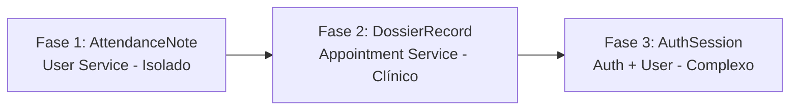

# Plano de Implementação Modular - SAM Backend

Para garantir a estabilidade do sistema e assegurar que as implementações sejam seguras, sustentáveis e fáceis de testar, a melhor estratégia é avançar **por partes (passo a passo)**. 

Dividiremos o plano em **3 Fases Incrementais**, ordenadas da menor para a maior complexidade técnica e de acoplamento de microsserviços.

---

## 🗺️ Fluxo Estratégico das Fases

---

## 📅 Fase 1: Anotações de Atendimento (`AttendanceNote`)
**Foco:** Gestão de notas rápidas de psicologia/pedagogia. É a fase mais isolada e simples, perfeita para estabelecer os padrões de validação.

### O que faremos:
1.  **DTOs de Entrada (`sam-user-service`):**
    *   `CreateAttendanceNoteDto`: Validação de `title` (string), `description` (string), `requestId` (string, UUID) e `optionTags` (array de strings opcional).
    *   `UpdateAttendanceNoteDto`: Permite edição parcial de título, descrição e tags.
2.  **Lógica de Serviço (`AttendanceNoteService`):**
    *   Criação de notas vinculando-as ao `userId` e ao `requestId`.
    *   Listagem de notas por `requestId` (para que a psicóloga veja o histórico daquela solicitação específica).
    *   Atualização e exclusão com validação se a nota realmente existe.
3.  **Controlador (`AttendanceNoteController`):**
    *   Exposição das rotas REST de CRUD.
4.  **Gateway (`sam-gateway`):**
    *   Mapear e encaminhar as rotas através do proxy dinâmico.

### Rotas a serem expostas no Gateway:
*   `POST /sam/users/notes` (Criar anotação)
*   `GET /sam/users/notes/request/:requestId` (Listar anotações de uma solicitação)
*   `PATCH /sam/users/notes/:id` (Atualizar anotação)
*   `DELETE /sam/users/notes/:id` (Excluir anotação)

---

## 📅 Fase 2: Evoluções do Dossiê (`DossierRecord`)
**Foco:** Registro clínico cronológico detalhado no microsserviço de atendimento, introduzindo o conceito de visibilidade e privacidade das informações terapêuticas.

### O que faremos:
1.  **DTOs de Entrada (`sam-appointment-service`):**
    *   `CreateDossierRecordDto`: Validação de `title`, `description`, `optionTags`, `visibility` (enum: `PRIVADO_PSICOLOGA`, `ADMINISTRATIVO`) e `createdBy` (UUID do usuário logado).
    *   `UpdateDossierRecordDto`: Edição dos campos.
2.  **Lógica de Serviço (`DossierRecordService`):**
    *   Criação de evolução atrelada a um `Dossier` existente.
    *   Garantia de integridade (não criar evolução para dossiê inexistente).
    *   Listagem cronológica das evoluções de um dossiê específico.
3.  **Controlador (`DossierRecordController`):**
    *   Exposição das rotas REST de CRUD.
4.  **Gateway (`sam-gateway`):**
    *   Mapear e configurar o proxy no gateway.

### Rotas a serem expostas no Gateway:
*   `POST /sam/appointments/dossiers/:dossierId/records` (Criar evolução no dossiê)
*   `GET /sam/appointments/dossiers/:dossierId/records` (Listar histórico cronológico do dossiê)
*   `PATCH /sam/appointments/records/:id` (Editar uma evolução)
*   `DELETE /sam/appointments/records/:id` (Remover registro clínico)

---

## 📅 Fase 3: Sessões e Refresh Tokens (`AuthSession`)
**Foco:** Segurança avançada e autenticação resiliente. É a fase mais complexa, pois exige coordenação em tempo real entre dois microsserviços (`sam-auth-service` e `sam-user-service`).

### O que faremos:
1.  **Gestão de Sessões (`sam-user-service`):**
    *   Criar métodos para persistir a sessão de login (guardando IP, User Agent, hash do Refresh Token e data de expiração).
    *   Criar rotas internas de validação e rota para revogar a sessão (logout/invalidação de token).
2.  **Orquestração de Login e Renovação (`sam-auth-service`):**
    *   **Login atualizado:** Ao logar, além de assinar o JWT (Access Token de 15 minutos), gera um Refresh Token aleatório e seguro (de 7 dias). Chama o `sam-user-service` via HTTP interno para salvar esta sessão.
    *   **Endpoint `/refresh`:** Recebe o Refresh Token, valida-o no banco via requisição ao `sam-user-service`, faz a rotação (emite novos Access Token e Refresh Token) e invalida a sessão antiga para prevenir ataques de reutilização de token (*Refresh Token Rotation*).
    *   **Endpoint `/logout`:** Recebe o token ativo e invalida a sessão no banco imediatamente.
3.  **Gateway (`sam-gateway`):**
    *   Mapear as novas rotas de renovação e saída de sessão.

### Rotas a serem expostas no Gateway:
*   `POST /sam/auth/login` (Atualizada para retornar `accessToken` e `refreshToken` nos cookies ou corpo)
*   `POST /sam/auth/refresh` (Rotacionar tokens)
*   `POST /sam/auth/logout` (Revogar a sessão ativa)

---

## 🚀 Próximo Passo

> [!TIP]
> **Recomendação:** Iniciar imediatamente pela **Fase 1: Anotações de Atendimento (`AttendanceNote`)**, pois ela é 100% autocontida no `sam-user-service`, permitindo validar as conexões Prisma locais e o fluxo do Gateway de forma simples e segura antes de avançarmos para as evoluções clínicas e a autenticação.

Gostaria de iniciar a implementação da **Fase 1** agora?
